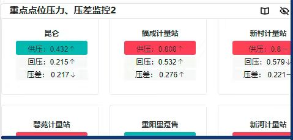
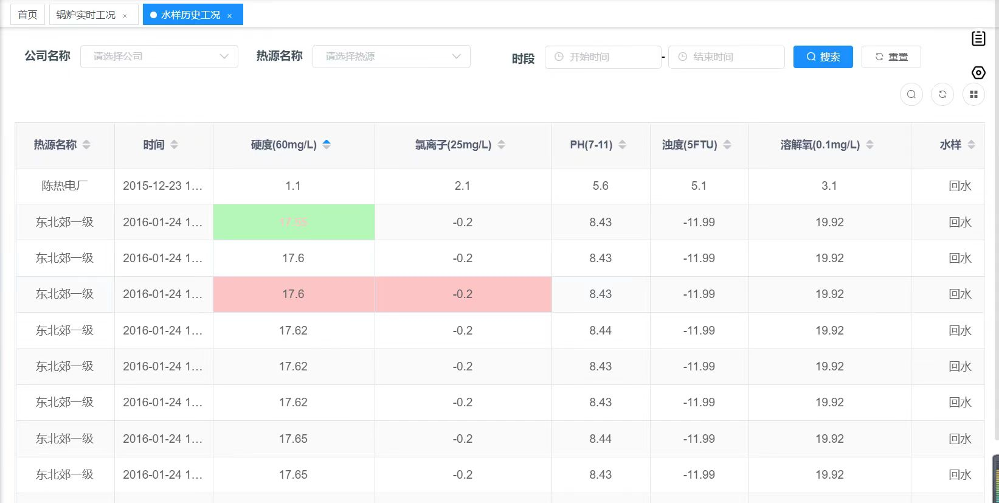
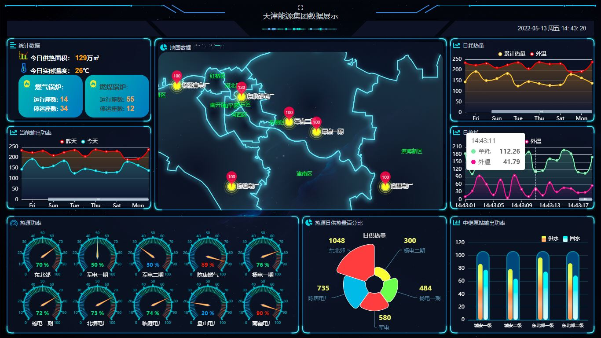

### 天津能源集团供热调度指挥平台

#### 项目描述

从集团供热系统实际出发，结合供热调度指挥工作特点，提出实时监控系统自动辅助监控维护优化方案；从而通过进一步提升实时监控系统的自动化、智能化水平，实现自动辅助监控报警；最终达到确保供热系统安全稳定、经济高效运行的效果。

#### 项目技术栈

SpringCloud、MybatisPlus、ECharts、Oracle、Redis、Socket.IO、 ElasticSearch、Kafka

#### 本人主要工作
- 运用设计模式搭建和开发方便维护和易于迭代的数据异常多级报警模块

 
 

- 基于**微服务架构**对系统核心业务功能进行开发工作

 

- 设计存储过程**优化系统分库分表、读写分离**
- 使用消息队列对系统请求进行削峰。使用Redis以及全文检索，提升部分查询请求速度
- 将部分获取热力数据的**轮询方式改为实时推送**

 

